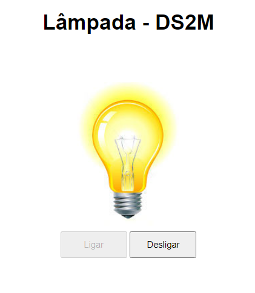

# Lâmpada - DS2M
Site criado com o objetivo didático para as aulas de PWFE do curso de Desenvolvimento de Sistemas do SENAI Jandira, sob orientação do professor [Fernando Leonid](https://github.com/fernandoleonid).

O projeto consiste em criar uma lâmpada que tenha quatro ações: ligar, desligar, piscar e quebrar. 

